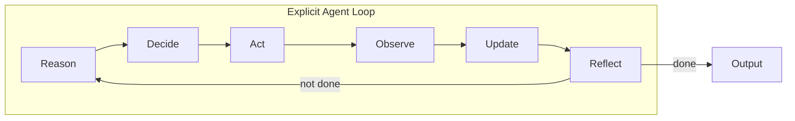

# Scratch Agent from First Principles

## Goal

Build an agent where every mechanic is manually implemented and visible: the loop, when/why the model is called, how tools are chosen, how memory is used, how decisions and reflection work, and how errors are handled. The planning/reasoning model will be local via a placeholder client you will later connect to Ollama or LM Studio.

---

## Architecture Overview

- **Reason**: Build context (task + memory + history), call local LLM for reasoning.
- **Decide**: Same or separate call where model outputs structured “what to do next” (action, tool?, args, confidence, stop?, revise?).
- **Act**: If a tool was chosen, execute it; otherwise treat as internal step.
- **Observe**: Capture tool result or step outcome.
- **Update**: Append to memory and turn history.
- **Reflect**: Call model for self-critique (assumptions, confidence, need to revise?); if revise, loop back without advancing.

---

## 1. Placeholder Local LLM Client

**File**: `local_llm.py` (or `llm_client.py`)

- Define a small interface your agent will use, for example:
  - `complete(prompt: str, **kwargs) -> str`
  - Optionally: `complete_structured(prompt: str, schema: dict) -> dict` for decision/reflection outputs.
- Implement a **placeholder** that:
  - Returns a fixed string (e.g. “PLACEHOLDER_RESPONSE”) or a minimal dict so the rest of the agent runs without a real model.
  - Clearly marks where you will later plug in Ollama/LM Studio (e.g. `# TODO: connect to Ollama / LM Studio`).
- No framework dependency; raw HTTP or `requests` to your local endpoint is fine to stub.

This keeps “when the model is called” and “what the model returns” explicit and swappable.

---

## 2. Explicit Control Loop

**File**: `agent_loop.py` (or `scratch_agent.py`)

Implement a single, visible main loop that evaluators can point to as “the agent loop”:

- **Loop condition**: e.g. `while not done and step_count < max_steps`.
- **Per iteration**:
  1. **Build context**: current task, memory contents, last N turns (tool calls + results).
  2. **Reason** (optional but clear): call local LLM with “Here is the situation; what do you know so far and what’s missing?” to get a reasoning string. Log it.
  3. **Decide**: call local LLM with a prompt that asks explicitly:
    - What should I do next?
    - Do I need a tool? If so, which one and with what arguments?
    - Is my information sufficient?
    - How confident am I?
    - Should I revise my approach?
    - Should I stop and respond to the user?
  4. **Parse decision**: map model output to a simple struct (e.g. `next_action`, `tool_id`, `tool_input`, `confidence`, `should_stop`, `should_revise`). This is the single place where “the agent decides what to do next.”
  5. **Act**: if `tool_id` is set, look up the tool, run it with `tool_input`, catch errors.
  6. **Observe**: record tool result (or “no tool”) and any error.
  7. **Update**: append to memory (e.g. “Used tool X; result: …”) and to turn history.
  8. **Reflect**: call local LLM for self-critique (see below). If “should_revise” or reflection says revise, loop again without incrementing “final answer”; otherwise, if `should_stop`, set `done = True` and form the final response.

Log at each step: “Reasoning: …”, “Decision: …”, “Tool chosen: … (reason: …)”, “Observation: …”, “Reflection: …”, “Confidence: …”. This satisfies “autonomy is visible” in logs.

---

## 3. Model-Driven Tool Use

**Files**: `tools.py` (registry + implementations), referenced from `agent_loop.py`

- **Tool registry**: a list or dict of tools. Each tool has: `id`, `description`, `parameters` (or schema), and `fn` (callable).
- **No fixed order**: the agent never calls tools in a hardcoded sequence. The **model’s decision** (from the Decide step) selects `tool_id` and `tool_input`. The loop then runs `registry[tool_id].fn(**tool_input)`.
- Implement 1–2 simple tools (e.g. “search” returning mock data, “get_contact” for a prospect) so that “model chooses tool” is demonstrable.
- On tool error: log it, put the error message into “Observe” and memory, and continue the loop so the model can retry or change strategy (retries/error handling visible).

---

## 4. Memory That Influences Decisions

**File**: `memory.py` (or in-memory structure in `agent_loop.py`)

- **Store**: list of “facts” or “observations” (e.g. strings or small dicts): prior tool results, key findings, assumptions, user constraints.
- **Read**: when building context for Reason/Decide, inject the last K items or a summary of memory into the prompt so the model “remembers” prior findings.
- **Update**: after each Act/Observe, append to memory (e.g. “Used search(‘X’): result …”; “Assumption: …”).
- Keep the memory structure simple (e.g. a list or a small class with `add`/`get_recent`/`get_summary`). The important part is that the **same memory is passed into the decision step** so “memory influences decisions” is obvious in code and logs.

---

## 5. Reflection / Self-Critique (Visible in Flow)

**Location**: Inside the main loop in `agent_loop.py`, after Update and before deciding “done.”

- **Reflection call**: dedicated call to the local LLM with a prompt like: “Given the task, what you did so far, and the results, evaluate: What assumptions are you making? Is your information sufficient? How confident are you? Should you revise your approach or stop and answer?”
- **Structured or freeform**: either parse “confidence”, “should_revise”, “gaps” from the model, or use a short freeform critique and then a small heuristic (e.g. if “revise” in the text, set `should_revise = True`).
- **Visible in flow**: the loop explicitly has a “Reflect” step; its output is logged and used to set `should_revise` or `should_stop`. No hidden framework magic.

---

## 6. Error Handling and Retries

- **Tool errors**: catch exceptions in the tool execution; pass error message back into Observe and memory; do not crash the loop. Optionally allow a retry count per tool or per step.
- **Parse errors**: if the Decide step output cannot be parsed, retry the Decide call once with “Your previous response was invalid; please respond in the exact format: …” and log the retry.
- **Model errors**: if the local LLM client raises (e.g. connection error), log, optionally retry N times, then fail with a clear message.

All of this is in your code; no framework “retry” abstraction.

---

## 7. Project Layout (Suggested)

- `local_llm.py` – Placeholder local LLM client (Ollama/LM Studio to be connected later).
- `agent_loop.py` – Main scratch agent: loop, reason, decide, act, observe, update, reflect.
- `tools.py` – Tool registry and 1–2 example tools.
- `memory.py` – Memory add/get; used by the loop.
- `decisions.py` (optional) – Parse model output into a decision struct (or keep this in `agent_loop.py`).
- `config.py` or env – Max steps, model name placeholder, etc.

No framework imports for “agent” or “tool” orchestration; only what you need (e.g. `requests` for later HTTP to local model, standard library otherwise).

---

## 8. What Evaluators Should See

- **Where the agent decides**: one clear place where the model’s text is parsed into `next_action`, `tool_id`, `should_stop`, etc. (the Decide step).
- **Why tools were chosen**: reasoning and decision logs that include the model’s explanation.
- **Why confidence changed**: reflection and decision logs over time.
- **That memory influences decisions**: memory content included in the prompts for Reason/Decide, and updates after each step.
- **That reflection exists**: a distinct Reflect step and logs showing “Reflection: …” and “should_revise: …”.

---

## 9. Local Model Requirement

The planning/reasoning model must run **locally** (no hosted cloud API). The placeholder in `local_llm.py` will be the only call site; when you add Ollama or LM Studio, you will replace the placeholder implementation with real inference there, keeping the same interface so all “model calls” remain explicit and local.

---

## Implementation Order

1. Add `local_llm.py` with the placeholder client and clear TODO for Ollama/LM Studio.
2. Add `memory.py` with a simple store and read/update API.
3. Add `tools.py` with registry and 1–2 example tools.
4. Add `agent_loop.py`: loop, context building, Reason → Decide → Act → Observe → Update → Reflect, with full logging.
5. Add decision parsing (in-loop or in `decisions.py`) and wire it to the placeholder LLM output format.
6. Add error handling and optional retries for tools and for parse failures.
7. Test run with placeholder LLM to confirm the loop, tool path, memory, and reflection are all visible and functioning.

This gives you a single, clear agent implementation from first principles, with a placeholder for the local model that you can connect to Ollama or LM Studio when ready.